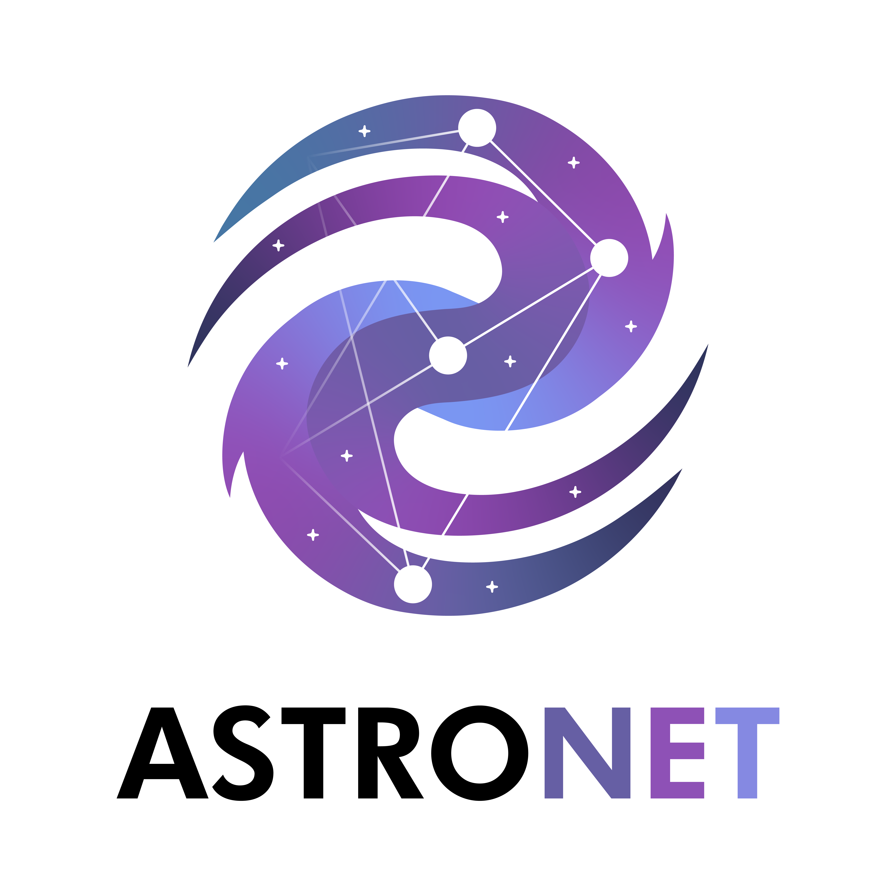

<!-- PROJECT LOGO -->
<br />
<p align="center">
  <a href="https://github.com/othneildrew/Best-README-Template">
    
  </a>

  <h3 align="center">AstroNet</h3>

  <p align="center">
    Deep Learning Approaches to the SKA Science Data Challenge 1
    <br />
    <a href="https://github.com/vairodp/AstroNet/tree/main/docs"><strong>Explore the docs »</strong></a>
    <br />
    <br />
  </p>
</p>


<!-- ABOUT THE PROJECT -->
## About The Project

In this project we developed a series of deep learning models to detect and classify astronomical sources from radio images. In particular, we approached the problem both as on object detection and as an image segmentation task, implementing from scratch both YOLOv4 and U-Net. The first network did not achieve an optimal performance (partially due to shortage of training data), while the latter reached a an accuracy of 97,3%.

## Requirements

The code requires python >= 2.7 as well as the following python libraries:

* astropy
* imgaug
* matplotlib
* numpy
* pandas
* scikit-learn
* tensorflow
* tensorflow-datasets
* tqdm
* opencv-python

**Install Modules:** 

```sh
  pip install -U pip
  pip install -r requirements.txt
  ```

**Try Demos** 
* AstroNet_U-Net Notebook [](https://github.com/vairodp/AstroNet/blob/main/AstroNet_UNet.ipynb)
* AstroNet_YOLOv4 Notebook [](https://github.com/vairodp/AstroNet/blob/main/AstroNet_YOLOv4.ipynb)


## Authors

**Martina Rossini** - [mwritescode](https://github.com/mwritescode) - martina.rossini704@gmail.com

**Vairo Di Pasquale** - [vairodp](https://github.com/vairodp) - vairo.dp@gmail.com
